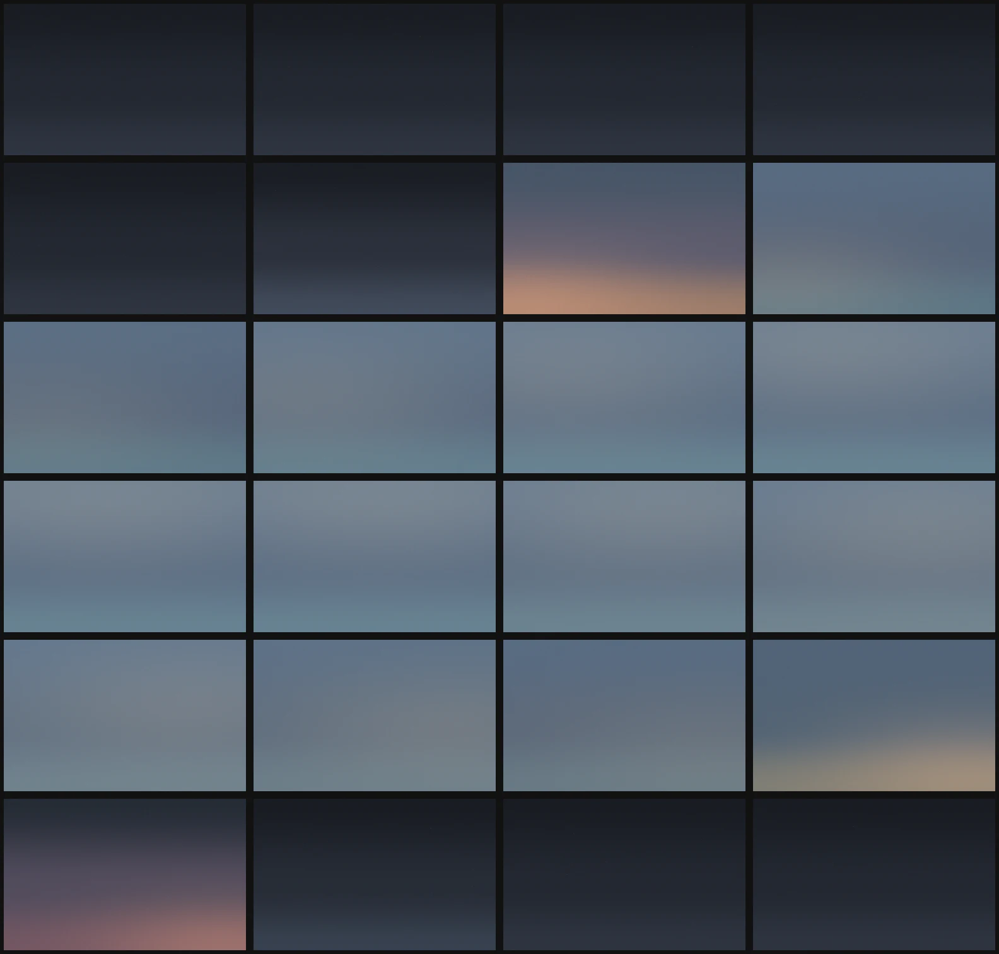

# skybg



**Theme-aware sky backgrounds that follow the sun and local weather on Omarchy.**

`skybg` renders a quiet gradient from the active Omarchy theme, the sun's
elevation and azimuth, and current cloud cover. A soft glow crosses the screen
from east to west; cloud and fog flatten the sky; clear nights reveal a fixed
celestial sphere that turns with sidereal time.

It is built for Omarchy Quattro. Change themes and the sky retints itself.
Choose another background and `skybg` bows out after confirming the change.

| Sunrise | Clear night |
| --- | --- |
|  |  |

## Requirements

- Omarchy Quattro
- Python 3.11 or newer
- ImageMagick (`magick` and `montage`)
- systemd user services
- Optional: [linecast](https://github.com/ashuttl/linecast) for automatic location
- Optional: network access for Open-Meteo cloud and fog data

## Install

```sh
git clone https://github.com/ashuttl/skybg.git
cd skybg
./install.sh
```

The installer copies only user-owned files and does not start the timer. Set a
location explicitly, or use `auto` when `linecast location` is configured:

```sh
skybg config location 43.677 -70.371
# or
skybg config location auto

skybg doctor
skybg preview
skybg on
```

## Commands

```text
skybg on                 Set the background and start the five-minute timer
skybg off                Stop the timer; leave the current background alone
skybg once               Render and set one background
skybg tick               Quiet timer entry point
skybg status             Show the sky and runtime state
skybg doctor             Check dependencies and integration
skybg preview [0..100]   Render a 24-hour montage; optionally fix cloud cover
skybg config show
skybg config location LAT LON
skybg config location auto
skybg config weather on|off
```

Configuration lives at `${XDG_CONFIG_HOME:-~/.config}/skybg/config.json`.
Generated images, cached location and weather, and the render lock live under
`${XDG_STATE_HOME:-~/.local/state}/skybg/`.

## Location, weather, and privacy

In automatic mode, `skybg` asks `linecast location` for coordinates and caches
the result. It never guesses a location. Without linecast or an explicit
location, it stops with setup instructions.

Weather mode sends latitude and longitude to the
[Open-Meteo forecast API](https://open-meteo.com/) to request current cloud
cover and weather code. Results are cached for 20 minutes. If the request
fails, `skybg` uses the last result, then a mild 30% cloud fallback. Disable
all weather requests with:

```sh
skybg config weather off
```

Solar position and stars are calculated locally.

## Omarchy integration

`skybg` uses `omarchy theme bg set` to change the live background. A supported
`theme-set` hook rerenders while its timer is active, so every theme supplies
its own palette. The current background alternates between two generated files
because Quattro watches the background symlink target.

## Updating and removing

Pull a new tagged release and rerun `./install.sh`; installation is idempotent.

```sh
./uninstall.sh          # retain config and generated state
./uninstall.sh --purge  # remove those too
```

Uninstalling never changes the current background.

## License

MIT. See [LICENSE](LICENSE).
